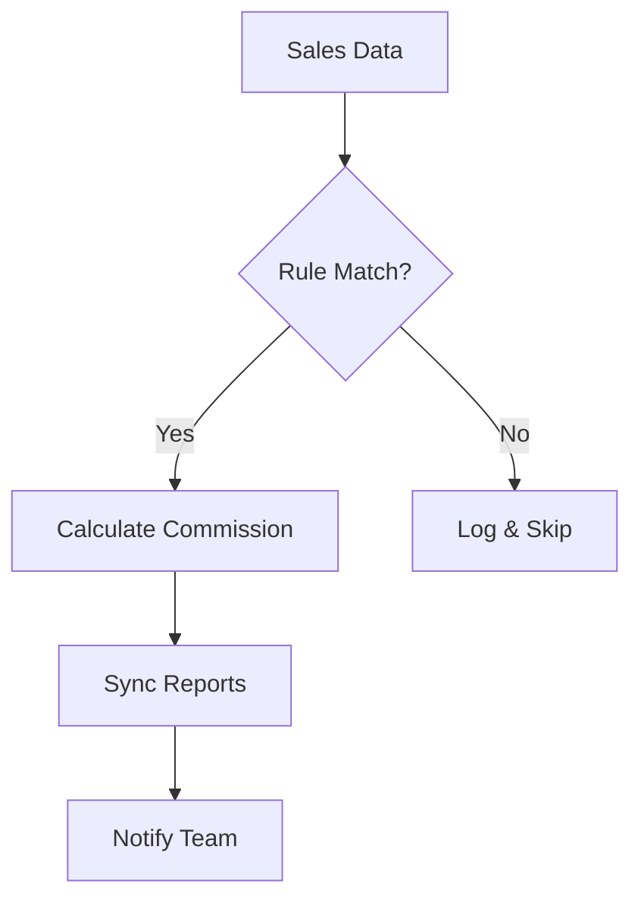

## Overview

RevTrack automates commission calculations by connecting your sales data sources and applying customizable rules. You eliminate manual errors and gain real-time insights into payouts. Key features include automated rules, seamless data integration, powerful reporting, and flexible customization to fit your business model.

<Columns cols={2}>
  <Card title="Automated Rules" icon="zap" href="/docs/rules">
    Define commission structures without coding.
  </Card>
  <Card title="Data Syncing" icon="database" href="/docs/integration">
    Connect CRM and sales platforms effortlessly.
  </Card>
  <Card title="Reporting" icon="bar-chart-3" href="/docs/reports">
    Generate insights and export data quickly.
  </Card>
  <Card title="Customization" icon="settings" href="/docs/customize">
    Tailor everything to your unique needs.
  </Card>
</Columns>

## Automated Calculation Rules

You create rules that automatically compute commissions based on sales performance, tiers, and conditions. RevTrack processes data in real time, applying splits for teams or overrides for special cases.

<Steps>
  <Step title="Define Rule Structure" icon="edit-3">
    Access the Rules dashboard and select `Add Rule`.

    ```json
    {
      "name": "Sales Tier 1",
      "conditions": {
        "dealValue": { ">": 10000 }
      },
      "payout": {
        "percentage": 0.05,
        "split": [0.7, 0.3]
      }
    }
    ```
  </Step>
  <Step title="Test and Activate" icon="play">
    Preview calculations on sample data, then enable live processing.
  </Step>
  <Step title="Monitor Performance" icon="activity">
    View execution logs and adjust as sales grow.
  </Step>
</Steps>

<Callout kind="tip">
  Start with simple flat-rate rules before adding tiers to ensure smooth rollout.
</Callout>

## Data Integration and Syncing

RevTrack syncs data from multiple sources, ensuring commissions reflect the latest sales. You configure webhooks or API pulls for continuous updates.

<Tabs>
  <Tab title="CRM (Salesforce)" icon="cloud">
    Use OAuth for secure access.

    <CodeGroup tabs="JSON,cURL">
      ```json
      {
        "provider": "salesforce",
        "credentials": {
          "clientId": "YOUR_CLIENT_ID",
          "token": "YOUR_ACCESS_TOKEN"
        },
        "syncInterval": "5m"
      }
      ```

      ```bash
      curl -X POST https://api.revtrack.com/integrations \
        -H "Authorization: Bearer YOUR_API_KEY" \
        -d '{"provider": "salesforce", "clientId": "YOUR_CLIENT_ID"}'
      ```
    </CodeGroup>
  </Tab>
  <Tab title="E-commerce (Shopify)" icon="shopping-bag">
    Connect via API key for order data.

    ```javascript
    const shopifyConfig = {
      apiKey: 'YOUR_SHOPIFY_KEY',
      shopDomain: 'your-store.myshopify.com',
      events: ['order/created']
    };
    ```
  </Tab>
</Tabs>

## Reporting and Analytics

Generate detailed reports on commissions earned, paid, and pending. Filter by rep, period, or product to uncover trends.

| Report Type     | Key Metrics                  | Export Formats |
|-----------------|------------------------------|----------------|
| Commission Summary | Total earned, avg payout    | CSV, PDF      |
| Rep Performance | Deals closed, tier progress | Excel, JSON   |
| Payout History  | Paid amounts, disputes      | PDF, API      |

<Expandable title="Advanced Filters" default-open="false">
  Combine metrics like `{repId}` and `{dateRange}` for custom dashboards.

  ```json
  {
    "filters": {
      "repId": "rep_123",
      "dateRange": { "start": "2024-01-01", "end": "2024-12-31" },
      "minDealValue": 5000
    }
  }
  ```
</Expandable>

## Customization Options

Tailor RevTrack to your workflow with custom fields, workflows, and UI themes using the brand color `#559bf6`. Extend via webhooks for third-party notifications.



This setup ensures precise, scalable commission management. Integrate today to boost efficiency.