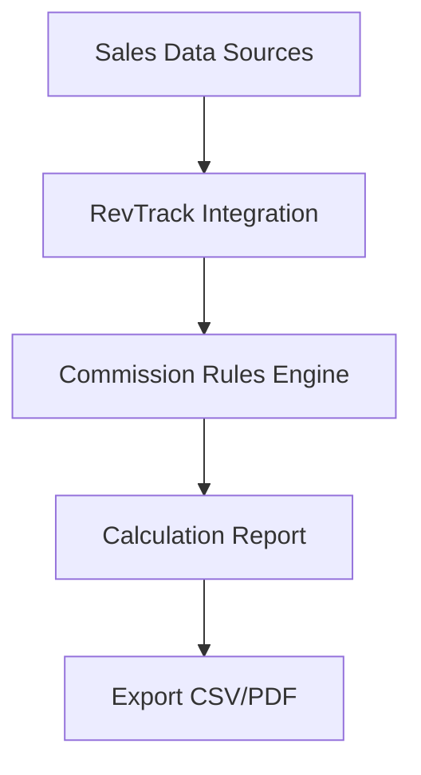

## Overview

RevTrack automates commission calculations by connecting your sales data sources. You eliminate manual errors and gain precise results in minutes. Follow these steps to create your account, connect data, configure settings, and run your first calculation.

<Callout kind="tip">
  Prepare your sales data credentials (API keys or OAuth tokens) before starting. This speeds up integration.
</Callout>

## Step-by-Step Setup

Use these numbered steps to get RevTrack running.

<Steps>
  <Step title="Create Account" icon="user-plus">
    Visit [app.revtrack.com](https://app.revtrack.com) and click **Sign Up**.

    Fill in your email, company name, and password. Verify your email to activate the account.

    <Image
      src="https://example.com/signup-screenshot.png"
      alt="RevTrack signup form with email and company fields"
      width="800"
      height="500"
    />
  </Step>

  <Step title="Connect Sales Data" icon="link">
    In the dashboard, navigate to **Integrations** > **Add Source**.

    Choose your CRM or sales platform from the list.

    <Tabs>
      <Tab title="Salesforce" icon="cloud">
        Click **Connect Salesforce**. Log in with OAuth and grant permissions for sales objects like Opportunities and Accounts.
        
        Test the connection to confirm data flows correctly.
      </Tab>
      <Tab title="HubSpot" icon="database">
        Enter your HubSpot API key and select Deal and Contact properties.
        
        ```bash
        # Example HubSpot API key usage (replace with yours)
        curl -H "Authorization: Bearer YOUR_HUBSPOT_KEY" https://api.hubapi.com/deals/v1/deal/paged
        ```
      </Tab>
      <Tab title="Custom API" icon="code">
        Provide your endpoint URL and authentication details.
        
        <CodeGroup tabs="JavaScript,Python">
          ```javascript
          const response = await fetch('https://api.revtrack.com/v1/sources', {
            method: 'POST',
            headers: { 'Authorization': 'Bearer YOUR_REVTRACK_KEY' },
            body: JSON.stringify({
              name: 'Custom Sales API',
              url: 'https://your-sales-api.com/deals',
              auth: { type: 'bearer', token: 'your-sales-token' }
            })
          });
          ```
          ```python
          import requests
          response = requests.post(
              'https://api.revtrack.com/v1/sources',
              headers={'Authorization': 'Bearer YOUR_REVTRACK_KEY'},
              json={
                  'name': 'Custom Sales API',
                  'url': 'https://your-sales-api.com/deals',
                  'auth': {'type': 'bearer', 'token': 'your-sales-token'}
              }
          )
          ```
        </CodeGroup>
      </Tab>
    </Tabs>
  </Step>

  <Step title="Configure Commissions" icon="settings">
    Go to **Commission Rules** and define your structure.

    Set base rates (e.g., 5% on deals `<100k`, 7% on deals `>100k`), tiers, and splits.

    | Rule Type | Example Rate | Applies To |
    |-----------|--------------|------------|
    | Base      | 5%           | All deals  |
    | Tier 1    | +2%          | `>50k`     |
    | Split     | 60/40        | Team sales |

    Save and validate rules against sample data.
  </Step>

  <Step title="Run First Calculation" icon="play">
    Select a date range in **Calculations** > **Run Now**.

    RevTrack processes your connected data and generates a report.

    Download the CSV or view the dashboard for commissions owed.

    <Callout kind="success">
      Your first calculation completes in under 2 minutes for most datasets.
    </Callout>
  </Step>
</Steps>

## Data Flow

Understand how RevTrack processes your information:



## Next Steps

Explore advanced features after setup.

<Columns cols={3}>
  <Card title="Custom Rules" icon="sliders" href="/docs/rules">
    Build complex tiered commissions and overrides.
  </Card>
  <Card title="Team Splits" icon="users" href="/docs/teams">
    Automate multi-person commission sharing.
  </Card>
  <Card title="Reports" icon="bar-chart-3" href="/docs/reports">
    Schedule and customize payout reports.
  </Card>
</Columns>

<Expandable title="Troubleshooting Common Issues" default-open="false">
  - **Connection fails**: Check API permissions and firewall rules.
  - **Zero commissions**: Verify deal stages map to "closed-won".
  - Contact support@revtrack.com for help.
</Expandable>