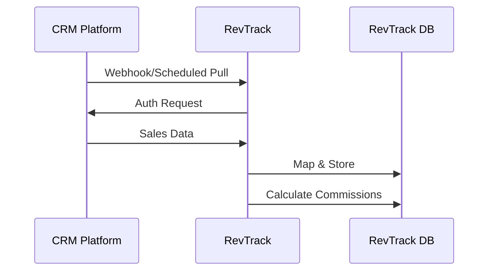

## Overview

RevTrack connects directly to your sales and CRM tools to automate commission calculations. You pull sales data in real-time, map fields accurately, and sync without manual exports. Supported platforms include Salesforce, HubSpot, and Stripe, ensuring precise commission tracking across your stack.

<Callout kind="info">
  Ensure you have admin access to your CRM and RevTrack accounts before starting. Integrations use secure OAuth 2.0 or API keys.
</Callout>

## Supported Integrations

RevTrack supports key platforms for seamless data flow. Choose from the grid below to get started.

<Columns cols={3}>
  <Card title="Salesforce" icon="database" href="#salesforce-setup">
    Sync opportunities, deals, and close dates automatically.
  </Card>
  <Card title="HubSpot" icon="users" href="#hubspot-setup">
    Import contacts, deals, and revenue data effortlessly.
  </Card>
  <Card title="Stripe" icon="credit-card" href="#stripe-setup">
    Track payments and invoices for commission triggers.
  </Card>
</Columns>

## General Setup Process

Follow these steps to connect any integration.

<Steps>
  <Step title="Generate API Credentials" icon="key">
    In your CRM dashboard, navigate to Settings > Integrations. Create a new app or connection for RevTrack and copy the `client_id` and `client_secret`.
  </Step>
  <Step title="Configure in RevTrack" icon="settings">
    Go to RevTrack Dashboard > Integrations. Select your platform and paste the credentials.
  </Step>
  <Step title="Authorize and Test" icon="check-circle">
    Click Authorize. RevTrack redirects for OAuth approval. Run a test sync to verify data flow.
  </Step>
</Steps>

## Platform-Specific Setup

Use the tabs below for detailed instructions per platform.

<Tabs>
  <Tab title="Salesforce" icon="database">
    <Steps>
      <Step title="Enable API Access">
        In Salesforce Setup, search for "Connected Apps" and create one with scopes: `api`, `refresh_token`, `offline_access`.
      </Step>
      <Step title="Map Fields">
        Use this sample mapping in RevTrack:
        ```json
        {
          "opportunity": {
            "amount": "Amount",
            "close_date": "CloseDate",
            "stage": "StageName"
          }
        }
        ```
      </Step>
    </Steps>
  </Tab>
  <Tab title="HubSpot" icon="users">
    <Steps>
      <Step title="Create Private App">
        In HubSpot Settings > Integrations > Private Apps, generate a token with `crm.objects.deals.read` scope.
      </Step>
      <Step title="Enter Token">
        Paste the `hapikey` into RevTrack's HubSpot integration form.
      </Step>
    </Steps>
  </Tab>
  <Tab title="Stripe" icon="credit-card">
    <Steps>
      <Step title="Get API Keys">
        From Stripe Dashboard > Developers > API Keys, copy the live or test secret key.
      </Step>
      <Step title="Configure Webhook">
        Add `https://api.revtrack.com/webhooks/stripe` as endpoint for `invoice.paid` and `payment_intent.succeeded` events.
      </Step>
    </Steps>
  </Tab>
</Tabs>

## Data Mapping and Synchronization

Customize how data maps from your CRM to RevTrack commission rules. Sync happens every 15 minutes or on webhooks for real-time updates.

| Source Field       | RevTrack Field     | Description                  | Sync Type    |
|--------------------|--------------------|------------------------------|--------------|
| Opportunity Amount | commission_amount | Sale value for calculation   | Bi-directional |
| Close Date         | payout_date       | Triggers commission accrual  | Pull-only    |
| Deal Stage         | status            | Filters qualified deals      | Pull-only    |
| Payment Status     | paid              | Confirms revenue recognition | Webhook      |

<CodeGroup tabs="Salesforce,HubSpot">
  ```json
  // Salesforce mapping
  {
    "mappings": {
      "Amount": "commission_base",
      "CloseDate": "accrual_date"
    },
    "sync_interval": "15m"
  }
  ```
  ```json
  // HubSpot mapping
  {
    "mappings": {
      "deal.amount": "commission_base",
      "deal.close_date": "accrual_date"
    },
    "sync_interval": "15m"
  }
  ```
</CodeGroup>



## Troubleshooting Common Issues

<ExpandableGroup>
  <Expandable title="Connection Fails - Invalid Credentials" default-open="true">
    Verify your `client_id` and `client_secret`. Regenerate if expired. Check RevTrack logs for error codes like `invalid_grant`.
  </Expandable>
  <Expandable title="Data Not Syncing">
    Confirm field mappings match exactly (case-sensitive). Test with a single record. Increase sync interval to 1h if rate-limited.
  </Expandable>
  <Expandable title="Duplicate Records">
    Enable deduplication in RevTrack settings using `deal_id` or `opportunity_id` as unique keys.
  </Expandable>
</ExpandableGroup>

<Callout kind="tip">
  Monitor sync status in RevTrack Dashboard > Integrations > Logs. Contact support@revtrack.com for persistent issues.
</Callout>