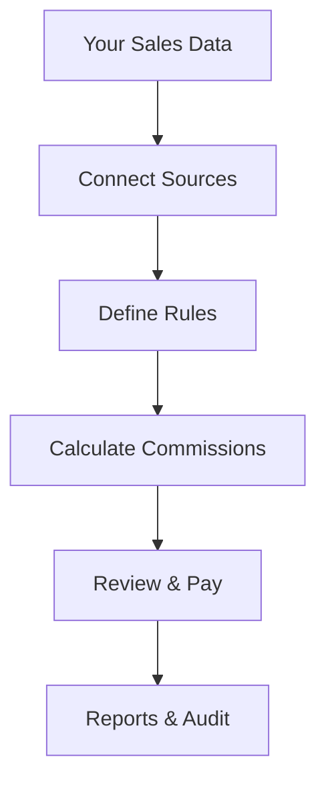

## Overview

RevTrack automates your commission calculations by integrating directly with your sales data sources. You eliminate manual errors and save hours of spreadsheet work. Connect RevTrack to CRMs like Salesforce or HubSpot, and it computes commissions precisely based on your rules.

RevTrack handles complex tiered structures, splits across teams, and real-time updates. You gain full visibility into calculations with detailed reports and audit trails.

## Key Benefits and Features

RevTrack delivers immediate value through these core capabilities.

<Columns cols={3}>
  <Card title="Precision" icon="target" href="/docs/accuracy">
    Calculate commissions with 100% accuracy using your exact business rules. No more disputes or overpayments.
  </Card>
  <Card title="Automation" icon="zap" href="/docs/automation">
    Connect once, automate forever. Eliminate monthly manual processes and focus on growth.
  </Card>
  <Card title="Insights" icon="bar-chart-3" href="/docs/reports">
    Access real-time dashboards and exportable reports to understand sales performance.
  </Card>
</Columns>

<Callout kind="tip">
  Start with our free trial to see commissions calculated in minutes using your sample data.
</Callout>

## How RevTrack Works

RevTrack follows a simple, secure workflow to process your commissions.



<Steps>
  <Step title="Connect Data" icon="database">
    Link RevTrack to your CRM or sales platform. Supported integrations include Salesforce, HubSpot, and CSV uploads.
  </Step>
  <Step title="Set Rules" icon="settings">
    Configure commission tiers, splits, and accelerators via our intuitive dashboard.
  </Step>
  <Step title="Automate" icon="play">
    Run calculations daily or on-demand. Review results before payout.
  </Step>
</Steps>

## Quick Integration Example

Integrate RevTrack into your workflow with minimal code. Use our API to push sales data or trigger calculations.

<CodeGroup tabs="JavaScript,Python">
  ```javascript
  const RevTrack = require('revtrack-sdk');

  const client = new RevTrack({ apiKey: 'YOUR_API_KEY' });

  async function calculateCommissions(salesData) {
    const result = await client.commissions.calculate({
      sales: salesData,
      rules: { tier1: { min: 1000, rate: 0.05 } }
    });
    console.log(result.totalPayout);
  }
  ```
  ```python
  from revtrack import RevTrack

  client = RevTrack(api_key="YOUR_API_KEY")

  def calculate_commissions(sales_data):
      result = client.commissions.calculate(
          sales=sales_data,
          rules={"tier1": {"min": 1000, "rate": 0.05}}
      )
      print(result["total_payout"])
  ```
</CodeGroup>

## Support and Resources

Access help whenever you need it.

<Tabs>
  <Tab title="Documentation" icon="book-open">
    Explore full guides on setup, rules, and APIs.
  </Tab>
  <Tab title="Community" icon="users">
    Join our forum for tips from other RevTrack users.
  </Tab>
  <Tab title="Contact Support" icon="mail">
    Email support@revtrack.com or use live chat for priority help.
  </Tab>
</Tabs>

<Expandable title="Advanced Resources" default-open="false">

- [API Reference](/docs/api)
- [Webinars and Tutorials](/docs/webinars)
- [Compliance Guide](/docs/compliance)

</Expandable>